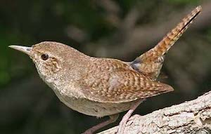
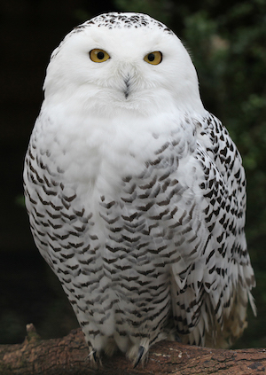
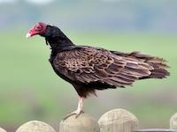
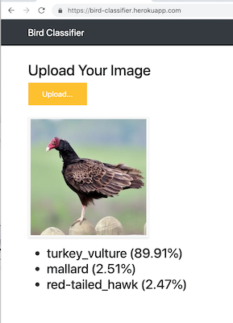
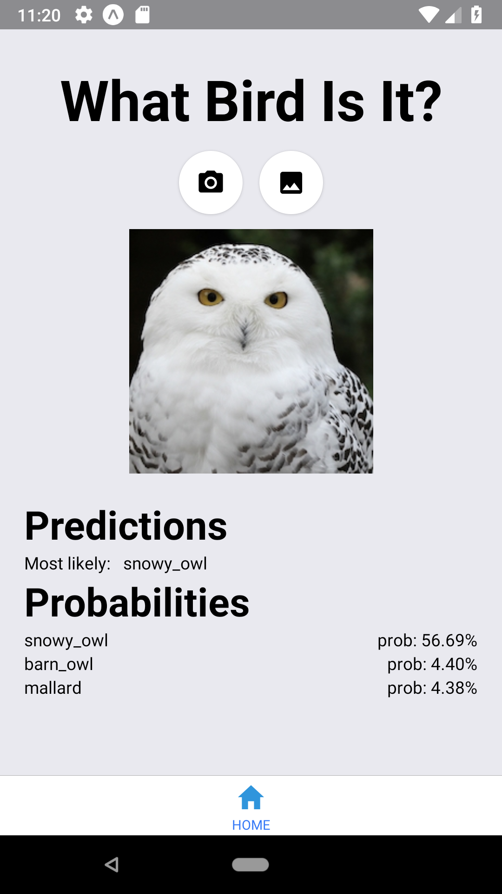

# About
There are more thant 900 bird species in North America. 


This repository contains a Deep Learning Model that given an image of a bird can classify it among 400 categories.


# Data
NABirds V1 is a collection of 48,000 annotated photographs of the 400 species of birds that are commonly observed in North America.    

More than 100 photographs are available for each species, including separate annotations for males, females and juveniles that comprise 700 visual categories.    

This dataset is to be used for fine-grained visual categorization experiments.

More than 550 visual categories, organized taxonomically
Photos curated in collaboration with domain experts

```
Grant Van Horn (gvanhorn@caltech.edu) 
http://dl.allaboutbirds.org/nabirds
```

## Sample Bird Images

House Wren
 



Turkey Vulture



# Demo

**Web App**


**Mobile App**




# Deploy
```
wget -qO- https://cli-assets.heroku.com/install-ubuntu.sh | sh
heroku login
heroku container:login

cd backend
APP_NAME="bird-classifier"
heroku create $APP_NAME

heroku container:push web --app ${APP_NAME}

heroku container:release web --app ${APP_NAME}
heroku open --app $APP_NAME
heroku logs --tail --app ${APP_NAME}

```


# Contact
[Nidhin Pattaniyil](https://npatta01.github.io)     
[Reshama Shaikh](https://reshamas.github.io/)


# References
Flask App Example [shankarj67]https://github.com/shankarj67/Water-classifier-fastai)